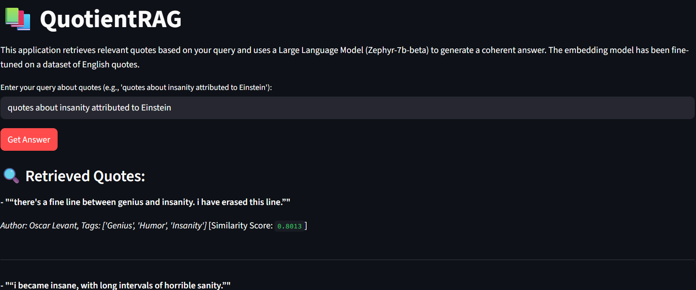

# QuotientRAG

**Semantic Quote Retrieval using Fine-Tuned Sentence Embeddings + RAG**

QuotientRAG is a Retrieval-Augmented Generation (RAG) pipeline that allows users to search for meaningful quotes using natural language queries. Given a prompt like *"quotes about insanity by Einstein"*, the system retrieves semantically relevant quotes, authors, and tags — and summarizes them using a language model. All in real-time, via an intuitive Streamlit interface.

## 🔍 Problem

Search engines and quote websites struggle with nuanced semantic queries. They rely on basic keyword matching and often miss contextual relevance. This project addresses that gap by combining vector search with transformer models, enabling intelligent quote discovery that understands the *intent* behind a user's query.

## 🧠 Pipeline Overview

The system consists of four core components:

1. **Data Preparation**
   - Dataset: [`Abirate/english_quotes`](https://huggingface.co/datasets/Abirate/english_quotes)
   - Cleaning: Lowercasing, tag formatting, deduplication
   - Exported as: `cleaned_quotes.csv`

2. **Model Fine-Tuning**
   - Base: `all-MiniLM-L6-v2` (Sentence Transformers)
   - Query-quote pairs constructed from tags and authors
   - Fine-tuned using `MultipleNegativesRankingLoss` for one epoch

3. **Vector Indexing**
   - Embeddings generated for all quotes
   - Indexed using FAISS (`IndexFlatL2`) for fast similarity search
   - Saved locally as `quotes_index.faiss`

4. **RAG + Generation**
   - Top-k quotes retrieved based on semantic similarity
   - Prompt constructed and passed to `HuggingFaceH4/zephyr-7b-beta` via Hugging Face Inference API
   - Outputs structured response: quotes, authors, tags, and synthesized summary

## 🚀 Streamlit App

Accessible on [Hugging Face Spaces](https://huggingface.co/spaces/namankr24/QuotientRAG), the app allows:

- Natural language search
- Structured quote display
- Real-time LLM summaries
- Optional score insights

<p align="center">
  
</p>
---


## 🛠️ Tech Stack

- `Python`, `Pandas`, `NumPy`
- `SentenceTransformers`, `FAISS`, `Hugging Face Transformers`
- `Streamlit` for the frontend UI
- `Zephyr-7B` (via Hugging Face API) for text generation

## 📁 Repository Structure

```bash
├── cleaned_quotes.csv           # Preprocessed dataset
├── quotes_index.faiss           # FAISS index
├── Streamlit_App.py             # Streamlit frontend
├── Pipeline.py                  # Core pipeline logic
└── requirements.txt             # Python dependencies
```

## 🧪 Example Query

Input: "quotes about insanity attributed to Einstein"
Output:

- "Insanity is doing the same thing over and over again and expecting different results."

- Author: Albert Einstein

- Tags: [insanity, repetition, mindset]

- LLM Summary: Synthesizes key themes across retrieved quotes

## 📌 Note

LLM API calls are rate-limited — may take a few seconds on first load.


## 📄 License

This project is licensed under the [MIT License](LICENSE).

## 📬 Contact

Naman Kumar

📧 Email: namankr24@gmail.com

🔗 GitHub: NamanKr24
